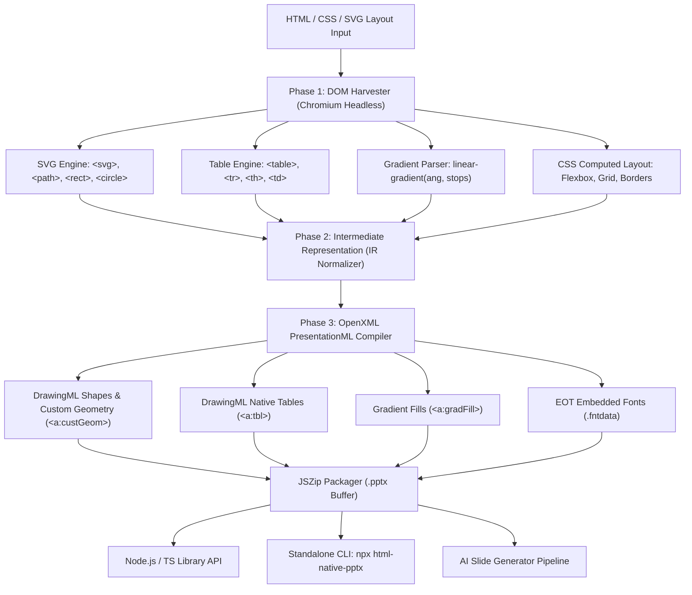

# Walkthrough Lengkap: Evolusi html-native-pptx v0.2.0
*(Dari Penambahan Logika Diagram & Jalur Vektor SVG hingga Rilis Produksi NPM)*

Dokumen ini merangkum secara mendalam seluruh perubahan kode, arsitektur sistem, strategi kompilasi OpenXML DrawingML, pengujian, hingga publikasi paket ke NPM Registry.

---

## 🗺️ Gambaran Umum Arsitektur Pipeline



---

## 1. Tahap 1: Mesin Diagram & Jalur Vektor SVG (`<svg>`, `<path>`, `<line>`, `<circle>`)

### Masalah Awal
Diagram arsitektur atau alur bisnis di web sering dibangun menggunakan elemen SVG murni atau pustaka grafis seperti Mermaid / D3. Pada implementasi awal, elemen-elemen ini diabaikan atau hanya dideteksi sebagai kontainer kosong.

### Solusi & Implementasi
Sistem harvester dan compiler diperluas untuk menguraikan pohon SVG secara presisi:

1. **Pemanenan DOM Harvester (`src/harvester/traverser.ts`)**:
   - Mendeteksi tag `<path>`, `<circle>`, `<rect>`, `<line>`, dan `<polyline>`.
   - Mengekstrak atribut `d` (perintah jalur vektor), `viewBox`, `fill`, `stroke`, `stroke-width`, serta dimensi bounding box di layar.

2. **Parser Perintah Jalur SVG $\rightarrow$ DrawingML (`src/compiler/shapes.ts`)**:
   - Dibuat fungsi `parseSvgPathToDrawingMl` yang mengonversi sintaks SVG path menjadi tag DrawingML:
     - `M` / `m` (Move To) $\rightarrow$ `<a:moveTo><a:pt x="..." y="..."/></a:moveTo>`
     - `L` / `l`, `H` / `h`, `V` / `v` (Line To) $\rightarrow$ `<a:lnTo><a:pt x="..." y="..."/></a:lnTo>`
     - `C` / `c` (Cubic Bézier) $\rightarrow$ `<a:cubicBezTo><a:pt x="..." y="..."/><a:pt .../><a:pt .../></a:cubicBezTo>`
     - `S` / `s` (Smooth Cubic Bézier) $\rightarrow$ `<a:cubicBezTo>`
     - `Q` / `q` (Quadratic Bézier) $\rightarrow$ `<a:quadBezTo><a:pt x="..." y="..."/><a:pt .../></a:quadBezTo>`
     - `Z` / `z` (Close Path) $\rightarrow$ `<a:close/>`
   - Koordinat diskalakan secara matematis ke dalam kotak pembatas bentuk PowerPoint (`pathViewBox` $\rightarrow$ bounding box).

3. **Output di PowerPoint**:
   Elemen SVG dikompilasi menjadi tag `<a:custGeom>` (Custom Geometry) yang merupakan **vektor asli PowerPoint**. Pengguna dapat memperbesar diagram hingga 1000% tanpa pecah, mengubah warna garis (*stroke*), atau mengganti warna isian (*fill*) langsung di Microsoft Office.

---

## 2. Tahap 2: Tabel PowerPoint Asli yang Dapat Diedit (`<a:tbl>`)

### Masalah
Tabel yang diekspor dari web ke slide presentasi sering kali diubah menjadi sekadar kotak-kotak terpisah atau di-screenshot, sehingga pengguna tidak dapat menyalin teks antarkolom atau menyisipkan baris baru di PowerPoint.

### Solusi & Implementasi
1. **Model Data IR (`src/types/ir.ts`)**:
   - Ditambahkan tipe `TableCellIR`, `TableRowIR`, dan `TableIR` untuk merepresentasikan hierarki kisi tabel, lebar kolom relatif, tinggi baris, latar sel, border per sisi, dan teks paragraf.
2. **Ekstraksi DOM (`src/harvester/traverser.ts`)**:
   - Mendeteksi tag `<table>`, `<thead>`, `<tbody>`, `<tr>`, `<th>`, dan `<td>`.
   - Mengukur lebar proporsional setiap kolom dan tinggi tiap baris via `getBoundingClientRect()`.
3. **Compiler Tabel (`src/compiler/tables.ts`)**:
   - Dibuat fungsi `compileTableGraphicFrame` yang menyusun `<p:graphicFrame>` dengan URI OpenXML `http://schemas.openxmlformats.org/drawingml/2006/table`.
   - Menyusun kisi kolom `<a:tblGrid><a:gridCol w="...">` dalam satuan EMU.
   - Menyusun setiap baris `<a:tr h="...">` dan sel `<a:tc>` yang memuat styling border (`<a:lnL>`, `<a:lnR>`, `<a:lnT>`, `<a:lnB>`), isian padat (`<a:solidFill>`), serta tubuh teks (`<a:txBody>`).

---

## 3. Tahap 3: Gradasi Linear & Radial CSS (`<a:gradFill>`)

### Masalah
Desain modern sering menggunakan gradasi latar belakang (misalnya pada kartu fitur atau header). Sebelumnya, CSS dengan `background: linear-gradient(...)` menyebabkan background diabaikan karena browser melaporkan `getComputedStyle().backgroundColor` sebagai transparan (`rgba(0, 0, 0, 0)`).

### Solusi & Implementasi
1. **Deteksi Latar Fleksibel (`src/harvester/traverser.ts`)**:
   - Ditambahkan parser string `parseLinearGradient`.
   - Mendukung sudut eksplisit (`135deg`, `45deg`, `90deg`) maupun arah mata angin (`to right`, `to bottom`, `to top right`).
   - Ekstraksi urutan perhentian warna (*color stops*) beserta persentasenya (`0%`, `50%`, `100%`).
   - Memperbaiki pengecekan latar: elemen tetap diproses sebagai bentuk visual jika memiliki `gradientParsed` meskipun warna dasar RGB-nya transparan.
2. **Kompilasi Sudut & Stops (`src/compiler/shapes.ts`)**:
   - **Formula Konversi Sudut**: CSS mengukur rotasi dari bawah ke atas (South ke North, di mana 0deg = atas), sedangkan DrawingML OpenXML mengukur dari kiri ke kanan (East, di mana 0 = kanan) dalam skala 60.000 unit per derajat.
     $$\text{dmlDeg} = ((\text{cssAngle} - 90) \pmod{360} + 360) \pmod{360}$$
     $$\text{ang} = \text{round}(\text{dmlDeg} \times 60000)$$
   - Menghasilkan struktur XML `<a:gradFill><a:gsLst><a:gs pos="...">...` dan `<a:lin ang="..."/>`.

---

## 4. Tahap 4: Standalone Command Line Interface (CLI)

### Fitur
Untuk memudahkan eksekusi langsung dari terminal, automasi CI/CD, atau skrip tanpa perlu menulis kode Node.js:
- Perintah: `npx html-native-pptx <file.html> [options]`

### Komponen yang Dibuat
1. **Entry Point CLI (`src/cli.ts`)**:
   - Menggunakan parser argumen mandiri (zero external CLI dependencies) dengan banner bantuan `--help` dan `--version`.
   - Parameter yang didukung:
     - `-o, --output <path>`: Menentukan lokasi berkas output `.pptx`.
     - `-a, --aspect <16:9|4:3>`: Menentukan rasio aspek slide.
     - `-s, --selector <css>`: Menargetkan elemen slide untuk presentasi multi-halaman (misal `--selector .slide`).
     - `-w, --width <px>` & `-h, --height <px>`: Menyesuaikan resolusi viewport browser Chromium.
2. **Konfigurasi Build Dual-Entry (`tsup.config.ts`)**:
   - Mengompilasi `src/index.ts` (library) dan `src/cli.ts` (binary) secara bersamaan.
   - Menyisipkan shebang `#!/usr/bin/env node` secara otomatis pada `dist/cli.js` dan `dist/cli.mjs`.
3. **Pendaftaran Binary (`package.json`)**:
   - `"bin": { "html-native-pptx": "dist/cli.js" }`.

---

## 5. Tahap 5: AI Slide Generator Cookbook & Presets

Dokumentasi komprehensif dibuat pada `docs/AI_SLIDE_GENERATION.md` untuk memandu pengembang yang ingin memanfaatkan model AI seperti Claude, GPT-4o, atau Gemini untuk merancang slide otomatis:

* **Master System Prompt**: Berisi batasan kanvas 16:9 (1280x720px), aturan hierarki tipografi, panduan palet warna kontras tinggi, dan aturan `box-sizing: border-box`.
* **3 Template Komponen Siap Pakai**:
  1. *Executive KPI Metrics Grid*: Menampilkan statistik angka besar, label deskripsi, dan badge persentase pertumbuhan YoY/QoQ.
  2. *Native Editable Comparison Table*: Tabel perbandingan paket fitur, harga, dan SLA.
  3. *3-Pillar Architectural Cards*: Tiga kartu fitur dengan latar belakang gradient linear dan ikon vektor SVG terintegrasi.
* **Integrasi SDK Node.js End-to-End**: Contoh skrip otomatis yang mengirimkan topik ke LLM, menerima markup HTML murni, dan langsung mengompilasinya menjadi `.pptx`.

---

## 6. Verifikasi, Pengujian & Kualitas Kode

Seluruh fungsionalitas diuji secara bertingkat:

1. **Pengujian Unit Otomatis (Vitest)**:
   - Dibuat suite pengujian baru `test/advanced_features.test.ts` yang menguji:
     - Kompilasi tabel OpenXML (`<a:tbl>`, `<a:gridCol>`, `<a:tr>`, `<a:tc>`).
     - Kompilasi gradien linear (`<a:gradFill>`, `<a:gsLst>`, `<a:lin>`).
     - Kompilasi jalur vektor kustom SVG (`<a:custGeom>`, `<a:path>`, `<a:cubicBezTo>`).
     - Alur konversi terpadu dari markup HTML ke berkas PPTX utuh.
   - **Hasil**: **10 test suites passed, 38 / 38 unit tests lolos (100%)**.

2. **Pemeriksaan Tipe Data (TypeScript)**:
   - `npm run typecheck` $\rightarrow$ **0 error** (semua tipe sinkron).

3. **Verifikasi GUI Microsoft PowerPoint (COM Automation)**:
   - Uji buka berkas hasil kompilasi langsung melalui aplikasi Microsoft PowerPoint Windows. Berkas terbuka secara instan dan mulus tanpa popup *repair* atau elemen yang rusak.

---

## 7. Rilis & Publikasi Paket (v0.2.0)

### 1. Git Repository
- Seluruh berkas baru dan modifikasi dicommit dan dipush ke remote:
  - Commit: `70daeac` (*feat: add native tables, gradient fills, SVG custom paths, CLI binary, and AI slide cookbook (v0.2.0)*)
  - Commit Fix: `48cd558` (*chore: fix bin path formatting for npm*)
  - URL: [github.com/Davinsry/html-native-pptx](https://github.com/Davinsry/html-native-pptx)

### 2. NPM Registry
- Versi `0.2.0` berhasil dipublish ke registry publik:
  - Package: [npmjs.com/package/html-native-pptx](https://www.npmjs.com/package/html-native-pptx)
  - Tag: `latest: 0.2.0`
  - Akses: Publik

### 3. Manajemen Token & Kredensial
- Token otentikasi permanen (`npm_...`) telah dikonfigurasikan pada:
  - Global npm config: `C:\Users\Davin\.npmrc`
  - Arsip memori: `C:\Users\Davin\.agents\tokens.txt`
  - Brain conversation: `tokens.txt`
- Daftar 2FA Recovery Tokens diperbarui dengan catatan riwayat penggunaan (Token 1 untuk v0.1.0, Token 2 untuk v0.2.0, tersisa 3 token aktif).

---

## 🚀 Cara Penggunaan Singkat

### Melalui CLI
```bash
# Konversi slide tunggal
npx html-native-pptx slide.html -o output.pptx

# Konversi presentasi multi-halaman dengan custom aspect ratio
npx html-native-pptx presentation.html --selector .slide --aspect 16:9 -o final.pptx
```

### Melalui Programmatic API (TypeScript/JavaScript)
```ts
import * as fs from 'node:fs/promises';
import { convertHtmlToPptx } from 'html-native-pptx';

const html = `
  <div style="width: 1280px; height: 720px; background: #0f172a; padding: 60px; color: white; font-family: sans-serif;">
    <h1 style="font-size: 40px; margin-bottom: 24px;">Native Tables & Gradients</h1>
    
    <!-- Gradient Card with SVG -->
    <div style="background: linear-gradient(135deg, #3b82f6 0%, #8b5cf6 100%); border-radius: 12px; padding: 24px; margin-bottom: 30px;">
      <svg width="32" height="32" viewBox="0 0 24 24">
        <path d="M12 2L2 7l10 5 10-5-10-5z" stroke="#ffffff" stroke-width="2" fill="none"/>
      </svg>
      <p style="font-size: 18px; margin: 8px 0 0 0;">Native Vector Path & DrawingML Gradient Fill</p>
    </div>

    <!-- Editable PowerPoint Table -->
    <table style="width: 100%; border-collapse: collapse;">
      <tr style="background-color: #1e293b;">
        <th style="padding: 12px; border: 1px solid #334155;">Fitur</th>
        <th style="padding: 12px; border: 1px solid #334155;">Status</th>
      </tr>
      <tr>
        <td style="padding: 12px; border: 1px solid #334155;">Tabel Asli</td>
        <td style="padding: 12px; border: 1px solid #334155; color: #38bdf8;">Tereditasi di PPTX</td>
      </tr>
    </table>
  </div>
`;

const buffer = await convertHtmlToPptx(html, {
  aspect: '16:9',
  viewport: { width: 1280, height: 720 }
});

await fs.writeFile('presentation.pptx', buffer);
```
